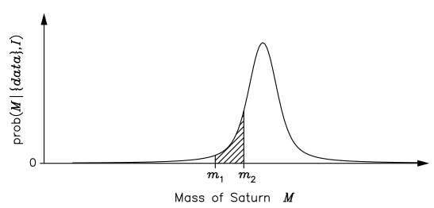

---
jupytext:
  formats: md:myst
  text_representation:
    extension: .md
    format_name: myst
kernelspec:
  display_name: Python 3
  language: python
  name: python3
---

# Statistical inference

<!-- !split -->
## How do you feel about statistics?
<!-- !bpop -->
```{epigraph}
> “There are three kinds of lies: lies, damned lies, and statistics.”

-- Disraeli (attr.): 
```

<!-- !epop -->

<!-- !bpop -->
```{epigraph}
> “If your result needs a statistician then you should design a better experiment.”

-- Rutherford
```

<!-- !epop -->

<!-- !bpop -->
```{epigraph}
> “La théorie des probabilités n'est que le bon sens réduit au calcul”
>
> (rules of statistical inference are an application of the laws of probability)

-- Laplace
```

<!-- !split -->
### Inference
 * Deductive inference. Cause $\to$ Effect. 
 * Inference to best explanation. Effect $\to$ Cause. 
 * Scientists need a way to:
    * Quantify the strength of inductive inferences;
    * Update that quantification as they acquire new data.


<!-- !split -->
### Some history
Adapted from D.S. Sivia {cite}`Sivia2006`

> Although the frequency definition appears to be more objective, its range of validity is also far more limited. For example, Laplace used (his) probability theory to estimate the mass of Saturn, given orbital data that were available to him from various astronomical observatories. In essence, he computed the posterior pdf for the mass $M$ , given the data and all the relevant background information I (such as a knowledge of the laws of classical mechanics): prob(M|{data},I); this is shown schematically in the {numref}`fig-sivia-1_2`.

```{figure} ./figs/sivia_fig_1_2.png
:name: fig-sivia-1_2

The posterior pdf for the mass of saturn (adapted from Sivia {cite}`Sivia2006`)
```

<!--  -->

> To Laplace, the (shaded) area under the posterior pdf curve between $m_1$ and $m_2$ was a measure of how much he believed that the mass of Saturn lay in the range $m_1 \le M \le m_2$. As such, the position of the maximum of the posterior pdf represents a best estimate of the mass; its width, or spread, about this optimal value gives an indication of the uncertainty in the estimate. Laplace stated that: ‘ . . . it is a bet of 11,000 to 1 that the error of this result is not 1/100th of its value.’ He would have won the bet, as another 150 years’ accumulation of data has changed the estimate by only 0.63%!


<!-- !split -->
> According to the frequency definition, however, we are not permitted to use probability theory to tackle this problem. This is because the mass of Saturn is a constant and not a random variable; therefore, it has no frequency distribution and so probability theory cannot be used.
> 
> If the pdf [of {numref}`fig-sivia-1_2`] had to be interpreted in terms of the frequency definition, we would have to imagine a large ensemble of universes in which everything remains constant apart from the mass of Saturn.


<!-- !split -->
> As this scenario appears quite far-fetched, we might be inclined to think [of {numref}`fig-sivia-1_2`] in terms of the distribution of the measurements of the mass in many repetitions of the experiment. Although we are at liberty to think about a problem in any way that facilitates its solution, or our understanding of it, having to seek a frequency interpretation for every data analysis problem seems rather perverse.
> For example, what do we mean by the ‘measurement of the mass’ when the data consist of orbital periods? Besides, why should we have to think about many repetitions of an experiment that never happened? What we really want to do is to make the best inference of the mass given the (few) data that we actually have; this is precisely the Bayes and Laplace view of probability.


<!-- !split -->
> Faced with the realization that the frequency definition of probability theory did not permit most real-life scientific problems to be addressed, a new subject was invented — statistics! To estimate the mass of Saturn, for example, one has to relate the mass to the data through some function called the statistic; since the data are subject to ‘random’ noise, the statistic becomes the random variable to which the rules of probability theory can be applied. But now the question arises: How should we choose the statistic? The frequentist approach does not yield a natural way of doing this and has, therefore, led to the development of several alternative schools of orthodox or conventional statistics. The masters, such as Fisher, Neyman and Pearson, provided a variety of different principles, which has merely resulted in a plethora of tests and procedures without any clear underlying rationale. This lack of unifying principles is, perhaps, at the heart of the shortcomings of the cook-book approach to statistics that students are often taught even today.


<!-- !split -->
## Probabilities and probability density functions (PDFs)

See the chapter on: {ref}`sec:Statistics`

In particular, review the following sections

 * Notation
 * Important definitions (PDFs, Expectations values and moments, Variance and covariance)
 * Important distributions
 * Quick introduction to  `scipy.stats`
 * Point estimates and credible regions