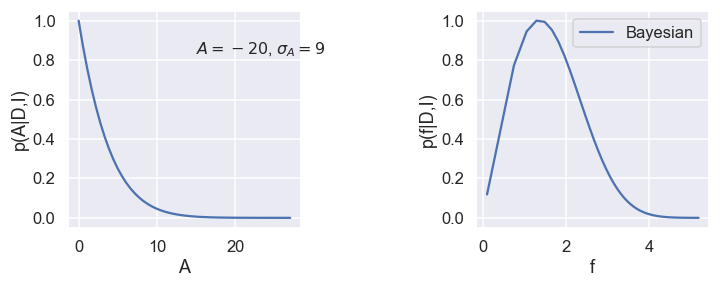

<!-- !split -->
# Advantages of the Bayesian approach

```{epigraph}
> *"Probability theory is nothing but common sense reduced to calculation."*

-- Laplace
```

```{epigraph}
> *"Bayesian inference probabilities are a measure of our state of knowledge about nature, not a measure of nature itself."*

-- Sivia
```


```{admonition} Why Bayes is Better
1. Provides an elegantly simple and rational approach for answering any scientific question for a given state of information. The procedure is well-defined:
   * Clearly state your question and prior information.
   * Apply the sum and product rules. The starting point is always Bayes’ theorem.
2. Provides a way of eliminating nuisance parameters through marginalization. 
   * For some problems, the marginalization can be performed analytically, permitting certain calculations to become computationally tractable.
3. Provides a well-defined procedure for propagating errors,
   * E.g., incorporating the effects of systematic errors arising from both the measurement operation and theoretical model predictions.
4. Incorporates relevant prior (e.g., known signal model or known theory model expansion) information through Bayes’ theorem. 
   * This is one of the great strengths of Bayesian analysis.
   * Enforces explicit assumptions.
   * For data with a small signal-to-noise ratio, a Bayesian analysis can frequently yield many orders of magnitude improvement in model parameter estimation, through the incorporation of relevant prior information about the signal model.
5. For some problems, a Bayesian analysis may simply lead to a familiar statistic. Even in this situation it often provides a powerful new insight concerning the interpretation of the statistic.
6. Provides a more powerful way of assessing competing theories at the forefront of science by automatically quantifying Occam’s razor. 
   * The evidence for two hypotheses, $H_i$ and $H_j$, can be compared by evaluating the ratio $p(H_i|D, I) / (H_j|D, I)$.
   * The Bayesian quantitative Occam’s razor can also save a lot of time that might otherwise be spent chasing noise artifacts that masquerade as possible detections of real phenomena.
```


```{admonition} Occam's razor
:class: tip
Occam’s razor is a principle attributed to the medieval philosopher William of Occam (or Ockham). The principle states that one should not make more assumptions than the minimum needed. It underlies all scientific modeling and theory building. It cautions us to choose from a set of otherwise equivalent models of a given phenomenon the simplest one. In any given model, Occam’s razor helps us to "shave off" those variables that are not really needed to explain the phenomenon. It was previously thought to be only a qualitative principle.
```

<!--  -->

```{figure} ./figs/Leprechaun_or_Clurichaun.png
:name: fig-Leprechaun

Did the Leprechaun drink your wine, or is there a simpler explanation?
```


<!-- !split -->
## Nuisance parameters

### Nuisance parameters (I): Bayesian Billiard

See demonstration notebook: A Bayesian Billiard game

<!-- !split -->
### Nuisance parameters (II): marginal distributions

Assume that we have a model with two parameters, $\theta_0,\theta_1$, although only one of them (say $\theta_1$) is of physical relevance (the other one is them labeled a nuisance parameter). Through a Bayesian data analysis we have the joint, posterior pdf

\begin{equation}

p(\theta_0, \theta_1 | D, I).

\end{equation}

The marginal posterior pdf $p(\theta_1 | D, I)$ is obtained via marginalization

\begin{equation}

p(\theta_1 | D, I) = \int p(\theta_0, \theta_1 | D, I) d\theta_0.

\end{equation}

Assume that we have $N$ samples from the joint pdf. This might be the Markov Chain from an MCMC sampler: $\left\{ (\theta_0, \theta_1)_i \right\}_{i=0}^{N-1}$. Then the marginal distribution of $\theta_1$ will be given by the same chain by simply ignoring the $\theta_0$ column, i.e., $\left\{ \theta_{1,i} \right\}_{i=0}^{N-1}$. 

See the interactive demos created by Chi Feng for an illustration of this: [The Markov-chain Monte Carlo Interactive Gallery](https://chi-feng.github.io/mcmc-demo/).

<!-- !split -->
## Error propagation

### Error propagation (I): marginalization

The Bayesian approach offers a straight-forward approach for dealing with (known) systematic uncertainties; namely by marginalization. Let us demonstrate this with an example

<!-- !split -->
**Inferring galactic distances with an imprecise knowledge of the Hubble constant**
The Hubble constant acts as a galactic ruler as it is used to measure astronomical distances according to $v = H_0 x$. An error in this ruler will therefore correspond to a systematic uncertainty in such measurements.

Here we use marginalization to obtain the desired posterior pdf $p(x|D,I)$ from the joint distribution of $p(x,H_0|D,I)$

$$
p(x|D,I) = \int_{-\infty}^\infty dH_0 p(x,H_0|D,I).
$$ (eq:marginalization)

Using Bayes' rule: $p(x,H_0|D,I) \propto p(D|x,H_0,I) p(x,H_0|I)$, the product rule: $p(x,H_0|I) = p(H_0|x,I)p(x|I)$, and the fact that $H_0$ is independent of $x$: $p(H_0|x,I) = p(H_0|I)$, we find that

\begin{equation}
p(x|D,I) \propto p(x|I) \int dH_0 p(H_0|I) p(D|x,H_0,I),
\end{equation}

which means that we have expressed the quantity that we want (the posterior of $x$) in terms of quantities that we know.

Assume that the pdf $p(H_0 | I)$ is known via $N$ samples $\{H_{i}\}_{i=0}^{N-1}$ generated by an MCMC sampler.

This means that we can approximate 

\begin{equation}

p(x |D,I) \propto \int dH_0 p(H_0|I) p(D|x,H_0,I) \approx \frac{1}{N} \sum_{i=1}^N p(D | x, H_i, I)

\end{equation}

where we have used a uniform prior for the distance $p(x|I) \propto 1$.


<!-- !split -->
### Error propagation (II): changing variables and prior information

(Based on Sivia, ch 3.6.)

Assume that we have measured parameter $X = 10 \pm 3$ and $Y=7 \pm 2$; what can we say about the difference $X-Y$ or the raio $X/Y$, or the sum of their squares $X^2+Y^2$, etc? In essence, the problem is nothing more than an exercise in the change of variables: given the joint pdf $p(X,Y|I)$, where the information $I$ might include the data if the pdf is a posterior from a data analysis, we need the corresponding pdf $p(Z|I)$, where $Z=X-Y$, or $Z=X/Y$, or whatever as appropriate.

<!-- !split -->
Let us start with a single variable $X$ and a function $Y=f(X)$. How is $p(X|I)$ related to $p(Y|I)$?

Consider a point $X^*$ and a small interval $\delta X$ around it. The probability that $X$ lies within that interval can be written

\begin{equation}

p \left( X^* - \frac{\delta X}{2} \le X < X^* + \frac{\delta X}{2} \big| I \right) 
\approx p(X=X^*|I) \delta X.

\end{equation}

<!-- !split -->
Assume now that the function $f$ will map the point $X=X^*$ uniquely onto $Y=Y^*=f(X^*)$. Then there must be an interval $\delta Y$ around $Y^*$ so that the probability is conserved

\begin{equation}

p(X=X^*|I) \delta X = p(Y=Y^*|I) \delta Y.

\end{equation}

<!-- !split -->
In the limit of infinitesimally small intervals, and with the realization that this should be true for any point $X$, we obtain the relationship

$$
p(X|I) = p(Y=Y|I) \left| \frac{dY}{dX} \right|,
$$ (eq:transformation)

where the term on the far right is called the *Jacobian*.

<!-- !split -->
The generalization to several variables, relating the pdf for $M$ variables $\{ X_j \}$ in terms of the same number of quantities $\{ Y_j \}$ related to them, is

$$
p(\{X_j\}|I) = p(\{Y_j\}|I) \left| \frac{\partial (Y_1, Y_2, \ldots, Y_M)}{\partial (X_1, X_2, \ldots, X_M)} \right|,
$$ (eq:multivariate-transformation)

where the multivariate Jacobian is given by the determinant of the $M \times M$ matrix of partial derivatives $\partial Y_i / \partial X_j$.

<!-- !split -->
*Summary.* 
We have now seen the basic ingredients required for the propagation of errors: it either involves a transformation in the sense of Eq. {eq}`eq:multivariate-transformation` or an integration as in Eq. {eq}`eq:marginalization`.

### Example: $Z = X + Y$

Let us consider the situation where you are interested in the quantity $Z = X + Y$, and you have information $I$ about $X$ and $Y$ which tells you that $X = x_0 \pm \sigma_x$ and $Y = y_0 \pm \sigma_y$. If this is all the information that we have, it is reasonable to assume that $X$ and $Y$ are independent and that we should assign Gaussian pdf:s (see the chapter on the Maximum Entropy principle)

\begin{equation}
p(X,Y|I) = p(X|I)p(Y|I) = \frac{1}{2\pi\sigma_x\sigma_y} \exp\left[ - \frac{(X-x_0)^2}{2\sigma_x^2} \right] \exp\left[ - \frac{(Y-y_0)^2}{2\sigma_y^2} \right].
\end{equation}

Let us now use marginalization and the product rule to find

\begin{equation}
p(Z|I) = \int p(Z,X,Y|I)dXdY = \int p(Z|X,Y,I) p(X,Y|I)dXdY.
\end{equation}

We realize that $p(Z|X,Y,I) = \delta(Z-(X+Y))$ due to the functional relationship between the parameters, and we have $p(X,Y|I)$ as a product of Gaussian pdf:s from above. The delta function can be used to evaluate one of the integrals, and the pdf for $Z$ becomes a convolution

\begin{equation}
p(Z|I) = \int p(X|I) p(Y=Z-X|I) dX = \frac{1}{2\pi\sigma_x\sigma_y} \int \exp\left[ - \frac{(X-x_0)^2}{2\sigma_x^2} \right] \exp\left[ - \frac{(Z - X - y_0)^2}{2\sigma_y^2} \right] dX.
\end{equation}

After some tedious algebra that involves completing the square for $X$ in the exponent we obtain

\begin{equation}
p(Z|I) = \frac{1}{\sqrt{2\pi}\sigma_z} \exp\left[ - \frac{(Z-z_0)^2}{2\sigma_z^2} \right], 
\end{equation}

with $z_0 = x_0 + y_0$ and $\sigma_z^2 = \sigma_x^2 + \sigma_y^2$. Thus, the pdf for the sum $Z=X+Y$, with $X$ and $Y$ being described by Gaussian pdf:s, is another Gaussian.

<!-- !split -->
### A useful short cut

For practical purposes, we are often satisfied to approximate pdfs with Gaussians. Within such limits there is an easier method that is often used for error propagation. Note, however, that there are instances when this method fails miserably as will be shown in the example further down.

Suppose that we have summarized the pdfs $p(X|I)$ and $p(Y|I)$ as two Gaussians with mean and standard deviation $x_0, \sigma_x$ and $y_0, \sigma_y$, respectively. Assume further that these two variables are not correlated, i.e., $p(X,Y|I) = p(X|I) p(Y|I)$.

<!-- !split -->
Suppose now that we are interested in $Z=X-Y$. Intuitively, we might guess that the best estimate $z_0 = x_0 - y_0$, but the error bar $\sigma_z$ requires some more thought. Differentiate the relation

\begin{equation}

\delta Z = \delta X - \delta Y.

\end{equation}

Square both sides and integrate to get the expectation value

\begin{equation}

\langle \delta Z^2 \rangle = \langle \delta X^2 + \delta Y^2 - 2 \delta x \delta Y \rangle = \langle \delta X^2 \rangle + \langle  \delta Y^2 \rangle - 2 \langle \delta X \delta Y \rangle,

\end{equation}

where we have employed the linear property for an integral over a sum of terms.

<!-- !split -->
Since we assumed that the pdfs for $X$ and $Y$ were described by independent Gaussians we have

$$
\langle \delta X^2 \rangle = \sigma_x^2; \qquad \langle \delta Y^2 \rangle = \sigma_y^2; \qquad \langle \delta X \delta Y \rangle = 0,
$$ (eq:stddev)

and we find that

\begin{equation}

\sigma_z = \sqrt{ \langle \delta Z^2 \rangle } = \sqrt{ \sigma_x^2 + \sigma_y^2 }.

\end{equation}

<!-- !split -->
Consider, as a second example, the ratio of two parameters $Z = X/Y$. Differentiation gives

\begin{equation}

\delta Z = \frac{Y \delta X - X \delta Y}{Y^2} \quad \Leftrightarrow \quad \frac{\delta Z}{Z} = \frac{\delta X}{X} - \frac{\delta Y}{Y}.

\end{equation}

Squaring both sides and taking the expectation values, we obtain

\begin{equation}

\frac{\langle \delta Z^2 \rangle}{z_0^2} = \frac{\langle \delta X^2 \rangle}{x_0^2} + \frac{\langle \delta Y^2 \rangle}{y_0^2} - 2 \frac{\langle \delta X \rangle \langle \delta ZY \rangle}{x_0 y_0},

\end{equation}

where the $X$, $Y$ and $Z$ in the denominator have been replaced by the constants $x_0$, $y_0$ and $z_0 = x_0 / y_0$ because we are interested in deviations from the peak of the pdf.

<!-- !split -->
Finally, substituting the information for the pdfs of $X$ and $Y$ as summarized in Eq. {eq}`eq:stddev` we finally obtain the propagated error for the ratio

\begin{equation}

\frac{\sigma_z}{z_0} = \sqrt{ \left( \frac{\sigma_x}{x_0} \right)^2 + \left( \frac{\sigma_y}{y_0} \right)^2}.

\end{equation}

<!-- !split -->
Despite its virtues, let us end our discussion of error-propagation with a salutary warning against the blind use of this nifty short cut.


<!-- !split -->
### Example: Taking the square root of a number

(Example 3.6.2 in Sivia {cite}`Sivia2006`)

* Assume that the amplitude of a Bragg peak is measured with an uncertainty $A = A_0 \pm \sigma_A$ from a least-squares fit to experimental data.
* The Bragg peak amplitude is proportional to the square of a complex structure function: $A = |F|^2 \equiv f^2$.
* What is $f = f_0 \pm \sigma_f$?

Obviously, we have that $f_0 = \sqrt{A_0}$. Differentiate the relation, square and take the expectation value

\begin{equation}

\langle \delta A^2 \rangle = 4 f_0^2 \langle \delta f^2 \rangle \quad 
\Leftrightarrow \quad 
\sigma_f = \frac{\sigma_A}{2 \sqrt{A_0}},

\end{equation}

where we have used the Gaussian approximation for the pdfs.

But what happens if the best fit gives $A_0 < 0$, which would not be impossible if we have weak and strongly overlapping peaks. The above equation obviously does not work since $f_0$ would be a complex number.

<!-- !split -->
We have made two mistakes:
1. Likelihood is not posterior!
2. The Gaussian approximation around the peak does not always work.

<!-- !split -->
Consider first the best fit of the signal peak. It implies that the likelihood can be approximated by

\begin{equation}

p(D | A, I) \propto \exp \left[ -\frac{(A-A_0)^2}{2\sigma_A^2} \right].

\end{equation}

However, the posterior for $A$ is $p(A|D,I) \propto p(D|A,I) p(A|I)$ and we should use the fact that we know that $A \ge 0$.

<!-- !split -->
We will incorporate this information through a simple step-function prior

\begin{equation}

p(A|I) = \left\{
\begin{array}{ll}
\frac{1}{A_\mathrm{max}}, & 0 \le A \le A_\mathrm{max}, \\
0, & \mathrm{otherwise}.
\end{array}
\right.

\end{equation}

This implies that the posterior will be a truncated Gaussian, and its maximum will always be above zero.

<!-- !split -->
This also implies that we cannot use the Gaussian approximation. Instead we will do the proper calculation using the transformation {eq}`eq:transformation`

\begin{equation}

p(f|D,I) = p(A|D,I) \left| \frac{dA}{df} \right| = 2 f p(A|D,I)

\end{equation}

In the end we find the proper Bayesian error propagation given by the pdf

\begin{equation}

p(f|D,I) \propto \left\{
\begin{array}{ll}
f \exp \left[ -\frac{(A-A_0)^2}{2\sigma_A^2} \right], & 0 \le f \le \sqrt{A_\mathrm{max}}, \\
0, & \mathrm{otherwise}.
\end{array}
\right.

\end{equation}

<!-- !split -->
Let us visualize the difference between the Bayesian and the naive error propagation for a few scenarios.


```python
def A_posterior(A,A0,sigA):
    pA = np.exp(-(A-A0)**2/(2*sigA**2))
    return pA/np.max(pA)

# Wrong analysis
def f_likelihood(f,A0,sigA):
    sigf = sigA / (2*np.sqrt(A0))
    pf = np.exp(-(f-np.sqrt(A0))**2/(2*sigf**2))
    return pf/np.max(pf)

# Correct error propagation
def f_posterior(f,A0,sigA):
    pf = f*np.exp(-(f**2-A0)**2/(2*sigA**2))
    return pf/np.max(pf)
```

```python
for (A0,sigA) in [(9,1),(1,9),(-20,9)]:
    maxA = max(2*A0,3*sigA)
    A_arr = np.linspace(0.01,maxA)
    f_arr = np.sqrt(A_arr)
    fig,ax=plt.subplots(1,2,figsize=(10,4))
    ax[0].plot(A_arr,A_posterior(A_arr,A0,sigA))
    ax[1].plot(f_arr,f_posterior(f_arr,A0,sigA),label='Bayesian')
    if A0>0:
        ax[1].plot(f_arr,f_likelihood(f_arr,A0,sigA),'--',label='Naive')
    ax[0].set(xlabel='A',ylabel='p(A|D,I)')
    plt.text(0.55,0.8,f'$A={A0}$, $\sigma_A={sigA}$', transform=ax[0].transAxes,fontsize=16)
    ax[1].set(xlabel='f',ylabel='p(f|D,I)')
    ax[1].legend(loc='best')
    plt.tight_layout()
```

<!-- !split -->
<!--  -->

```{figure} ./figs/error_square_root_9_1.png 
```
```{figure} ./figs/error_square_root_1_9.png 
```
```{figure} ./figs/error_square_root_-20_9.png
:name: fig-Sivia-9_1)

The left-hand panels show the posterior pdf for the amplitude of a Bragg peak in three different scenarios. The right-hand plots are the corresponding pdfs for the modulus of the structure factor $f=\sqrt{A}$. The solid lines correspond to a full bayesian error propagation, while the dashed lines are obtained with the short-cut error propagation.
```

<!-- !split -->
<!--  -->

<!-- !split -->
<!--  -->

