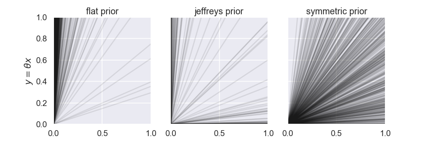

<!-- !split -->
# Ignorance pdfs: Indifference and translation groups

<!-- !split -->
## Discrete permutation invariance
* Consider a six-sided die
* How do we assign $p_i \equiv p(X_i|I)$, $i \in \{1, 2, 3, 4, 5, 6\}$?
* We do know $\sum_i p(X_i|I) = 1$
* Invariance under labeling $\Rightarrow p(X_i|I)=1/6$
  * provided that the prior information $I$ says nothing that breaks the permutation symmetry.

<!-- !split -->
## Location invariance
Indifference to a constant shift $x_0$ for a location parameter $x$ implies that

\begin{equation}

p(x|I) dx \approx p(x+ x_0|I) d(x+x_0) =  p(x+ x_0|I) dx,

\end{equation}

in the allowed range.

Location invariance implies that

\begin{equation}

p(x|I) =  p(x+ x_0|I) \quad \Rightarrow \quad p(x|I) = \mathrm{constant}.

\end{equation}

* Provided that the prior information $I$ says nothing that breaks the symmetry.
* The pdf will be zero outside the allowed range (specified by $I$).

<!-- !split -->
## Scale invariance

Indifference to a re-scaling $\lambda$ of a scale parameter $x$ implies that

\begin{equation}

p(x|I) dx \approx p(\lambda x|I) d(\lambda x) =  \lambda p(\lambda x|I) dx,

\end{equation}

in the allowed range.

<!-- !split -->
Invariance under re-scaling implies that

\begin{equation}

p(x|I) = \lambda p(\lambda x|I) \quad \Rightarrow \quad p(x|I) \propto 1/x.

\end{equation}

* Provided that the prior information $I$ says nothing that breaks the symmetry.
* The pdf will be zero outside the allowed range (specified by $I$).
* This prior is often called a *Jeffrey's prior*; it represents a complete ignorance of a scale parameter within an allowed range.
* It is equivalent to a uniform pdf for the logarithm: $p(\log(x)|I) = \mathrm{constant}$
  * as can be verified with a change of variable $y=\log(x)$, see lecture notes on error propagation.

<!-- !split -->
### Example: Straight-line model

Consider the theoretical model 

\begin{equation}

y_\mathrm{th}(x) = \theta_1  x  + \theta_0.

\end{equation}

* Would you consider the intercept $\theta_0$ a location or a scale parameter, or something else?
* Would you consider the slope $\theta_1$ a location or a scale parameter, or something else?

Consider also the statistical model for the observed data $y_i = y_\mathrm{th}(x_i) + \epsilon_i$, where we assume independent, Gaussian noise $\epsilon_i \sim \mathcal{N}(0, \sigma^2)$.
* Would you consider the standard deviation $\sigma$ a location or a scale parameter, or something else?

<!-- !split -->
## Symmetry invariance

* In fact, by symmetry indifference we could as well have written the linear model as $x_\mathrm{th}(y) = \theta_1'  y  + \theta_0'$
* We would then equate the probability elements for the two models 

\begin{equation}

p(\theta_0, \theta_1 | I) d\theta_0 d\theta_1 = q(\theta_0', \theta_1' | I) d\theta_0' d\theta_1'.

\end{equation}

* The transformation gives $(\theta_0', \theta_1') = (-\theta_1^{-1}\theta_0, \theta_1^{-1})$.

<!-- !split -->
This change of variables implies that

\begin{equation}

q(\theta_0', \theta_1' | I) = p(\theta_0, \theta_1 | I) \left| \frac{d\theta_0 d\theta_1}{d\theta_0' d\theta_1'} \right|,

\end{equation}

where the (absolute value of the) determinant of the Jacobian is

\begin{equation}

\left| \frac{d\theta_0 d\theta_1}{d\theta_0' d\theta_1'} \right| 
= \mathrm{abs} \left( 
\begin{vmatrix}
\frac{\partial \theta_0}{\partial \theta_0'} & \frac{\partial \theta_0}{\partial \theta_1'} \\
\frac{\partial \theta_1}{\partial \theta_0'} & \frac{\partial \theta_1}{\partial \theta_1'} 
\end{vmatrix}
\right)
= \frac{1}{\left( \theta_1' \right)^3}.

\end{equation}

<!-- !split -->
* In summary we find that $\theta_1^3 p(\theta_0, \theta_1 | I) = p(-\theta_1^{-1}\theta_0, \theta_1^{-1}|I).$
* This functional equation is satisfied by

\begin{equation}

p(\theta_0, \theta_1 | I) \propto \frac{1}{\left( 1 + \theta_1^2 \right)^{3/2}}.

\end{equation}

<!-- !split -->
<!-- 
<em>100 samples of straight lines with fixed intercept equal to 0 and slopes sampled from three different pdfs. Note in particular the  prior preference for large slopes that results from using a uniform pdf.</em>
 -->

